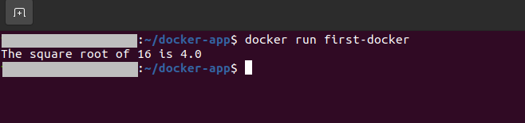

# First Python Script running using Docker

To build the docker we need to run this in the terminal:

```console
$ docker build -t first-docker .
```
Terminal output be like:


To run the docker container, run this in the terminal:

```console
$ docker run first-docker
```
Terminal output be like:



Full tutorial: [Medium Link](https://fahimsikder.medium.com/installing-docker-and-creating-running-first-python-script-using-it-on-ubuntu-20-04-lts-ca6415d6fa3d)